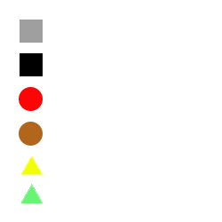

# Projeto 1 - Linguages de Programação II 22/23
## Autoria
- Pedro Silva - 22001798
    - Elaboração do relatório
    - UI Unity
    - Código
    - Revisão de código
    - Documentação

## Legendas
### Legenda Tiles

### Legenda Recursos

## Arquitetura de Solução
### Descrição de Solução
O programa inicia com uma consola que identifica todos os ficheiros com extensão ".map4x" dentro da pasta "map4xfiles" dentro do Ambiente de Trabalho do utilizador. De seguida, a aplicação `Program` coloca as opções disponíveis dentro de um *dropdown*, possibilitando ao jogador escolher qual mapa pretende que seja jogado.
Ao clicar no "*Start Game*" a aplicação lê todas as linhas dentro do ficheiro pretendido onde, identifica que a primeira linha representa as dimensões do mapa, colocando cada valor em variáveis (*rows* e *cols*). Para as restantes linhas, irá colocar o texto respetivo a cada linha dentro de uma variável, separando-a por *strings*. Desta forma a aplicação identifica o terreno pretendido e os recursos dentro do mesmo, até acabar a linha ou encontrar um comentário, quebrando o ciclo.
Dentro deste ciclo, caso o terreno pretendido tenha recursos, a aplicação irá criar um novo `Resource` que recebe o valor *string* do recurso, adicionando a uma lista para o terreno atual.
Caso a aplicação não identifique a primeira palavra como o inicio de um comentário, a mesma irá criar um novo `Tile` para cada linha válida, recebendo uma *string* correspondende ao tipo de terreno, bem como uma lista de recursos para o mesmo.
Finalizando o ciclo, a aplicação irá transportar a informação (*rows* e *cols*) para o `FillMap` que é responsável pela implementação do visual do mapa pretendido.

Dentro do projeto existem dois *scripts* responsáveis pelos tipos de terreno e recursos disponíveis, sendo eles, `TerrainType` e `ResourceType`.

Dentro do script responsável pelas variáveis de um terreno, o `Tile`, é possível encontrar um *IDictionary*, que recebe o valor em *string*, do ficheiro, e devolve o valor em `TerrainType`. Dentro do construtor, que recebe o valor *string* do terreno, bem como os recursos nele contidos, o mesmo atribui o valor `TerrainType` à variável inicializada anteriormente. De seguida, é iniciado um método que irá procurar pelo tipo de terreno, atribuindo os valores de *gold*, *food* e cor definidos no enunciado. Por fim, cria uma lista nova da anteriomente declarada, e, através de um ciclo, coloca todos os recursos recebidos pelo construitor dentro dessa lista.

O *script* `Resource` funciona da mesma forma, sendo que também contém um *IDictionary* para o valor *string* e o valor `ResourceType` correspondentes. A pricipal diferença está no construtor, que desta vez não precisa de uma lista de recursos. 

Dentro do `NewMap` podemos encontrar alguns métodos, responsáveis pela criação de uma matriz, utilizada no `Program`, bem como um método que devolve a informação `Tile` dentro das coordenadas estipuladas.

Já com o mapa criado, como referido anteriormente, o `TileFiller` irá receber a informação correspondente ao número de linhas e colunas, desta forma, irá instanciar um objeto definido como um "terreno base", que se pode encontrar na pasta dos *prefabs*, atribuindo a posição correta, começando em (0,0), bem como a cor respetiva e atribuida na classe `Tile`. Por fim, irá atribuir os recursos desse mesmo `Tile` a uma lista, podendo desta forma instanciar os recursos nele contidos, que funciona através de um ciclo. Este ciclo procura pelos 6 espaços disponiveis, dentro de um `Tile`, instanciando cada objeto com a posição desse mesmo espaço (sendo colocado como filho desse objeto).

Por fim, já com a possibilidade de visualizar o mapa, bem como os seus recursos, o jogador poderá andar com a camera (consultar `CameraDrag`):

    - Seta para a esquerda = movimento para a esquerda.
    - Seta para a direita = movimento para a direita.
    - Seta para cima = movimento para cima.
    - Seta para baixo = movimento para baixo.
De inicio, implementei a possibilidade de "arrastar" a camera, contudo, esta implementação acabava por causar alguns erros, já dentro do jogo.

Além de mover a camera, poderá também efetuar *zoom in* ou *zoom out*, através do scroll do rato. O scroll está limitado a valor definidos dentro do `ZoomScroll`.

Para o jogador obter informação de cada `Tile`, basta clicar em cima do mesmo. Através de um método disponível em cada terreno (consultar `TileClickInformation`), são enviadas as coordenadas deste terreno para outro *script* `ChangeWindowInformation` que disponibiliza a informação recebida dentro de um *canvas*, onde é possível observar o tipo de terreno, recursos nele contidos, ouro por ronda e comida por ronda.

